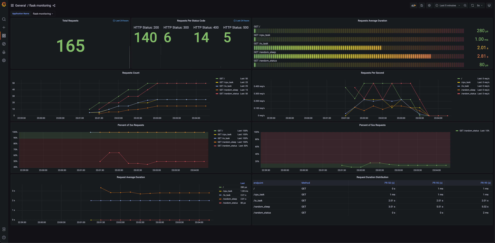

# Flask Monitoring

Monitor Flask application through custom StatsD metrics with Prometheus and Grafana.

1. Flask app sends StatsD format metrics by UDP to statsd_exporter
2. Prometheus scrapes prometheus format metrics from statsd_exporter 
3. Grafana queries data from Prometheus

```txt
+-----------------+                     +-------------------+                        +--------------+               +-----------+
|  Flask(StatsD)  |---(UDP repeater)--->|  statsd_exporter  |<---(scrape /metrics)---|  Prometheus  | <---(query)---|  Grafana  |
+-----------------+                     +-------------------+                        +--------------+               +-----------+
```

## Quick Start

1. Build application image and start all service with docker-compose

   ```bash
   docker-compose build
   docker-compose up -d
   ```

2. Send requests with [siege](https://linux.die.net/man/1/siege) to flask app

   ```bash
   bash request-script.sh
   ```

3. Check predefined dashboard ```flask monitoring``` on Grafana [http://localhost:3000/](http://localhost:3000/)

   Dashboard screenshot:

   

   Dashboard is also available on [Grafana Dashboards](https://grafana.com/grafana/dashboards/16111).


## Details

### Flask

1. Use [Datadog Python library](https://github.com/DataDog/datadogpy) to send StatsD format metrics in ```flask_app/utils.py```.
   1. ```setting_statsd```: Register StatsD host and port with environment variable ```STATSD_HOST```, ```STATSD_PORT```
   2. ```StatsdMiddleware```: Add custom metrics
2. Initial statsd with ```setting_statsd```, and add ```StatsdMiddleware``` to flask app in ```flask_app/app.py```.

### Statsd Exporter

[statsd exporter](https://github.com/prometheus/statsd_exporter) receives StatsD-style metrics and exports them as Prometheus metrics.

Ports:

1. 9125: default StatsD request listen port, send StatsD request to this port
2. 9102: Web expose port, get prometheus metrics from this port

Prometheus metrics is available on [http://localhost:9102/metrics](http://localhost:9102/metrics).

### Prometheus

Setting scrape job of statsd-exporter with config file ```etc/prometheus/prometheus.yml```.

```yaml
scrape_configs:
  - job_name: 'statsd-exporter'
    static_configs:
      - targets: ['statsd-exporter:9102']
```

Prometheus build-in web UI is available on [http://localhost:9090](http://localhost:9090).

### Grafana

Add prometheus to data source with config file ```etc/grafana/datasource.yml```.

```yml
datasources:
  # <string, required> name of the datasource. Required
  - name: Prometheus
    # <string, required> datasource type. Required
    type: prometheus
    # <string, required> access mode. proxy or direct (Server or Browser in the UI). Required
    access: proxy
    # <int> org id. will default to orgId 1 if not specified
    orgId: 1
    # <string> custom UID which can be used to reference this datasource in other parts of the configuration, if not specified will be generated automatically
    # uid: my_unique_uid
    # <string> url
    url: http://prometheus:9090
    # <bool> mark as default datasource. Max one per org
    isDefault: true
    version: 1
    # <bool> allow users to edit datasources from the UI.
    editable: false
```

Load predefined dashboard with ```etc/dashboards.yaml``` and ```etc/dashboards/flask-monitoring.json```.

```yaml
# grafana in docker-compose.yaml
grafana:
    image: grafana/grafana:8.4.3
    volumes:
      - ./etc/grafana/:/etc/grafana/provisioning/datasources
      - ./etc/dashboards.yaml:/etc/grafana/provisioning/dashboards/dashboards.yaml # dashboard setting
      - ./etc/dashboards:/etc/grafana/dashboards # dashboard json files directory
```

#### Dashboard

Flask monitoring dashboard from ```etc/dashboards/flask-monitoring.json```

This dashboard follows RED method proposed by [Weaveworks](https://www.weave.works/blog/the-red-method-key-metrics-for-microservices-architecture/), and monitors three key metrics:

1. Rate: requests rate, request count over past 24 hours
2. Errors: 2xx rate, 5xx rate, cumulative number of each status code over past 24 hours
3. Duration: average request duration, request duration distribution (PR50, PR90, PR99)

## Reference

1. [Monitoring Gunicorn with Prometheus](https://medium.com/@damianmyerscough/monitoring-gunicorn-with-prometheus-789954150069)
2. [Gunicorn Dashboard Sample](https://gist.github.com/dmyerscough/59896aa752ba48794d2aef4c7a0fdd6e)
3. [Gunircorn worker type in different scenario [Chinese]](https://medium.com/@genchilu/%E6%B7%BA%E8%AB%87-gunicorn-%E5%90%84%E5%80%8B-worker-type-%E9%81%A9%E5%90%88%E7%9A%84%E6%83%85%E5%A2%83-490b20707f28)
4. [Grafana datasource provisioning](https://grafana.com/docs/grafana/latest/administration/provisioning/)
5. [The RED Method: key metrics for microservices architecture](https://www.weave.works/blog/the-red-method-key-metrics-for-microservices-architecture/)
